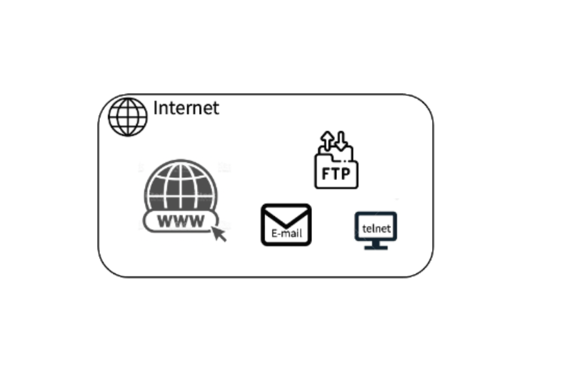

# 2️⃣ WWW (World Wide Web)
**인터넷 상에서 하이퍼텍스트와 하이퍼미디어를 사용해 문서를 연결하고 탐색할 수 있도록 설계된 글로벌 정보 공간**

</img><br/>
WWW는 인터넷과 동일하지 않다. 인터넷은 물리적 네트워크와 인프라를 의미하며, **WWW는 그 위에서 작동하는 하나의 서비스를 의미**한다.

## 2.1 WWW 구성 요소
1. **HTML** (HyperText Markup Language)
    - 웹 페이지를 작성하기 위한 마크업 언어
    - 텍스트, 이미지, 하이퍼링크 등을 구조화하여 표시
    ```html
      <html>
    <head>
      <title>예제 웹 페이지</title>
    </head>
    <body>
      <h1>환영합니다!</h1>
      <p>이것은 예제 웹 페이지입니다.</p>
      <a href="https://example.com">더 알아보기</a>
    </body>
  </html>

2. **HTTP** (HyperText Transfer Protocol)
    - 웹 브라우저와 웹 서버 간에 데이터를 주고받기 위한 통신 프로토콜
    - 요청(request)과 응답(response)의 형태로 작동
    - 현재 HTTP/3까지 발전하였으며, 보안을 강화한 HTTPS가 일반적으로 사용
3. **URL** (Uniform Resource Identifier)
    - 웹 상의 자원을 고유하게 식별하기 위한 주소 체계
    - URL(Uniform Resource Locator)은 URI의 한 형태로, 특정 웹 페이지의 위치를 나타냄
    - https://example.com

## 2.2 WWW 작동 원리
1. **사용자가 웹 브라우저에서 URL 입력**: https://example.com
2. **DNS 조회**: URL에 해당하는 도메인 이름(예: example.com)을 IP 주소로 변환
3. **HTTP 요청**: 웹 브라우저가 해당 서버로 HTTP 요청을 보냄
4. **서버 응답**: 요청받은 리소스(예: HTML 파일, 이미지 등)를 웹 브라우저로 전송
5. **브라우저가 렌더링**: 전송받은 데이터를 화면에 표시

## 2.3 WWW 장단점 
| 장점            | 단점           |
|---------------|--------------|
| **정보 접근성 강화** | **정보 과부하** |
| **글로벌 연결**    | **보안 문제**   |
| **다양한 표현 수단** | **의존성**     |
|  **확장성**      |  **비표준 콘텐츠** |

[이전 페이지: 01.hypertext](https://github.com/sslynn22/NHNacademy-java/blob/main/http%20server/docs/01.hypertext.md)

[다음 페이지: 03.www](https://github.com/sslynn22/NHNacademy-java/blob/main/http%20server/docs/03.html.md)
