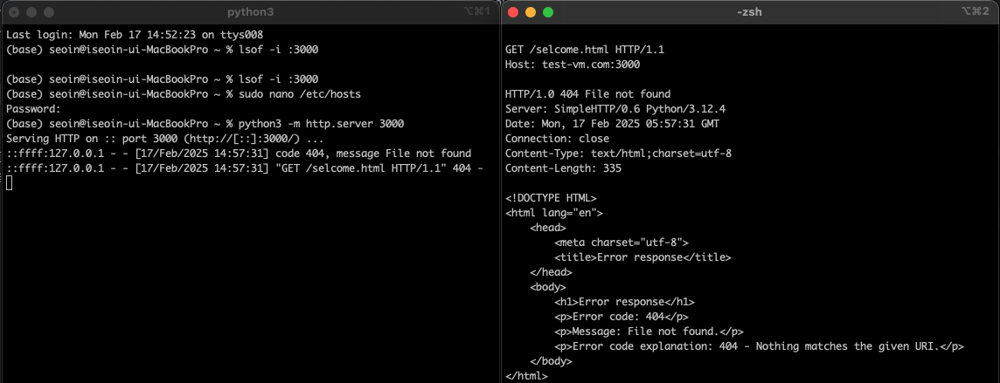
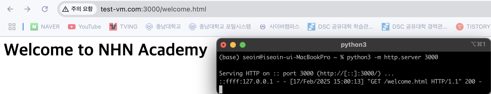

# 5️⃣ HTTP (HyperText Transfer Protocol)
HTTP는 인터넷 상에서 데이터를 주고받기 위한 프로토콜로, 웹에서 가장 널리 사용되는 프로토콜이다.

## 5.1 HTTP 특징
1. 비연결성 (Stateless): 각 요청(request)과 응답(response)은 독립적으로 처리
   - 서버는 클라이언트의 이전 요청 상태를 기억하지 않는다. 
   - 상태를 유지하려면 쿠키, 세션, JWT 등의 기술을 활용해야 한다. 
2. 요청-응답 구조: 클라이언트(예: 웹 브라우저)가 요청(request)을 보내고, 서버가 응답(response)을 반환하는 방식
3. 텍스트 기반 프로토콜: 요청과 응답 메시지는 사람이 읽을 수 있는 텍스트 형식
4. URI 사용: HTTP는 URI (Uniform Resource Identifier)를 사용하여 리소스를 식별
   - 일반적인 URI 형식: http://example.com/resource.
5. 확장 가능성: HTTP는 확장성이 뛰어나며, 최신 웹 애플리케이션에서도 계속 발전
   - 현재 HTTP/2와 HTTP/3까지 발전했다.

## 5.3 HTTP 요청 메세지 구조
클라이언트가 서버에 데이터를 요청할 때 사용됩
```
<요청 라인>  (예: GET /index.html HTTP/1.1)
<헤더>      (예: Host: example.com, User-Agent: ...)
<빈 줄>
<본문>      (POST 요청 시 데이터 포함)
```
요청 메서드

| 메서드   | 설명                | 본문 지원 여부 |
|-------|-------------------|----|
| GET   | 리소스를 요청           | ❌  |
| POST  | 리소스를 생성하거나 서버로 데이터를 전송 | ✅ |
| PUT   | 리소스를 업데이트하거나 생성   | ✅ |
| DELETE | 리소스를 삭제           | ❌ |
| HEAD  | 리소스의 헤더만 요청       | ❌ |
| OPTIONS | 서버에서 지원하는 메서드를 요청 | ❌ |
| PATCH | 리소스의 일부만 수정       | ✅ |

### 리소스와 데이터의 차이점
- 리소스: 데이터의 컨테이너 역할 (예. HTML파일, JSON 파일 등)
- 데이터: 특정 리소스가 제공하는 내용 (예. 웹페이지의 HTML 데이터, JSON 형식의 데이터 등)


## 5.3 HTTP 응답 메시지 (Response)
서버가 클라이언트 요청에 대해 응답할 때 사용
```
<상태 라인>  (예: HTTP/1.1 200 OK)
<헤더>      (예: Content-Type: text/html, Content-Length: ...)
<빈 줄>
<본문>      (HTML, JSON 등 응답 데이터)
```
상태 코드
- `1xx` (정보): 요청 진행 중 (예: 100 Continue)
- `2xx` (성공): 요청 성공 (예: 200 OK, 201 Created)
- `3xx` (리다이렉션): 추가 작업 필요 (예: 301 Moved Permanently, 302 Found)
- `4xx` (클라이언트 오류): 요청 실패 (예: 400 Bad Request, 401 Unauthorized, 404 Not Found)
- `5xx` (서버 오류): 서버 문제 (예: 500 Internal Server Error, 503 Service Unavailable)

# 5.4 HTTP의 주요 구성 요소
- 클라이언트: 요청을 생성하여 서버로 전송하는 역할
    - 예: 웹 브라우저, 모바일 앱, Postman.
- 서버: 클라이언트의 요청을 처리하고 응답을 생성하는 역할
  - 예: Apache, Nginx, Node.js.
- 프록시: 요청과 응답의 중간 단계에서 데이터를 필터링, 캐싱, 로깅 등

# 5.5 HTTPS (HTTP Secure)
HTTP에 SSL/TLS 암호화를 추가하여 보안을 강화한 프로토콜
- 데이터 암호화: 전송 중 데이터를 암호화
- 데이터 무결성: 데이터가 수정되지 않도록 보장
- 인증: 서버 또는 클라이언트의 신원 확인


---
# 🚀 HTTP 요청 테스트 (nc 사용)
로컬에서 가상의 도메인(test-vm.com)을 설정하고, Python HTTP 서버를 실행하여 nc(Netcat) 명령어로 HTTP 요청을 테스트한다.

HTTP Server 동작 확인
</img><br/>

웹 브라우저의 요청을 확인
</img><br/>

[이전 페이지: 04.url](https://github.com/sslynn22/NHNacademy-java/blob/main/http%20server/docs/04.url.md)
