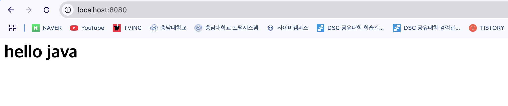
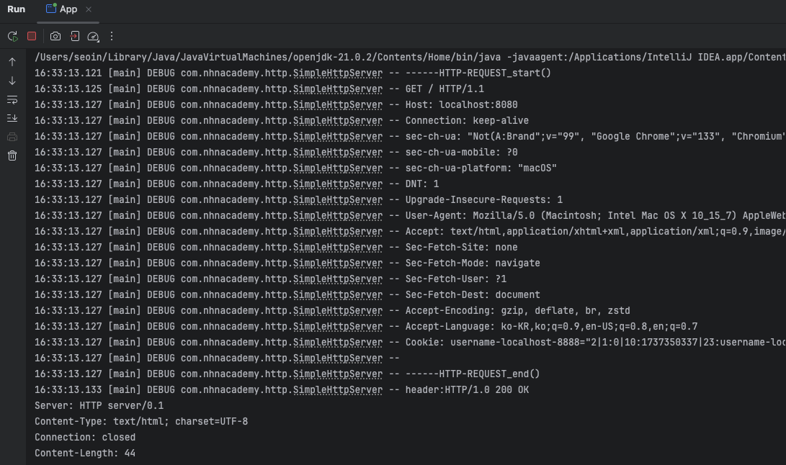

# Single Thread Http Server
클라이언트 요청을 받고 HTTP 응답을 반환하는 코드

## 📌 `SimpleHttpServer.class`
1. 서버 소켓 생성
   - ServerSocket 을 통해 지정된 포트(기본값: 8080)에서 클라이언트의 연결 요청을 대기
   - 포트가 0 이하이면 IllegalArgumentException 을 발생
2. 클라이언트 요청 처리
   - BufferedReader 로 클라이언트의 요청 데이터를 읽음
   - 요청이 null 이거나 빈 줄("")을 만나면 요청 종료로 판단
3. HTTP 응답 생성 및 전송
   - HTTP 헤더 생성
     - HTTP/1.0 200 OK
     - Content-Type: text/html; charset=UTF-8
     - Connection: close (응답 후 소켓 닫기)
     - Content-Length 설정
4. HTTP 바디 생성
   - ```<html><body><h1>hello java</h1></body></html>```를 클라이언트에 반환
   - 버퍼에 있는 응답을 flush()로 즉시 클라이언트에 전송


</img><br/>
</img><br/>

## 😵‍💫 Web Server = Socket Server?
웹 서버(Web Server)는 클라이언트(브라우저)의 요청을 받아 HTTP 응답을 반환하는 서버이다.

즉, 웹 서버는 HTTP 프로토콜을 기반으로 동작하는 소켓 서버(Socket Server) 라고 볼 수 있다.

---
### ✔︎ serverSocket.accept()
클라이언트가 연결될 때까지 블로킹되는 메서드
``` java
ServerSocket serverSocket = new ServerSocket(8080);

while(true) { 
    //TODO#5 client가 연결될 때까지 대기합니다.
    Socket client = serverSocket.accept();
}
```
- 서버 소켓(`ServerSocket`)이 클라이언트의 연결 요청을 기다림
- 클라이언트가 연결을 요청하면 새로운 `Socket` 객체를 반환하여 통신할 수 있도록 함

서버가 수락(accept)하면 읽기(BufferedReader), 쓰기(BufferedWriter)을 할 수 있다.
``` java
BufferedReader bufferedReader = new BufferedReader(new InputStreamReader(client.getInputStream()));
BufferedWriter bufferedWriter = new BufferedWriter(new OutputStreamWriter(client.getOutputStream()))
``` 


### ✔︎ flush()
버퍼(Buffer)에 쌓인 데이터를 강제로 내보내는 메서드
``` java
//TODO#16 buffer에 등록된 Response (header, body) flush 합니다.(socket을 통해서 clent에 응답합니다.)
bufferedWriter.flush();
```
- `BufferedWriter`는 내부 버퍼를 사용하여 데이터를 일정량 모은 후 한 번에 출력
- `flush()`를 호출하면 버퍼에 남아 있는 모든 데이터를 강제로 출력하여 클라이언트에게 즉시 전송
- HTTP 응답을 처리할 때 헤더 및 바디를 포함한 전체 응답을 보낸 후 반드시 `flush()`를 호출