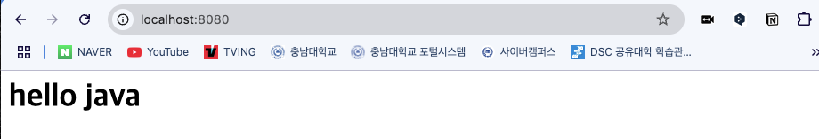
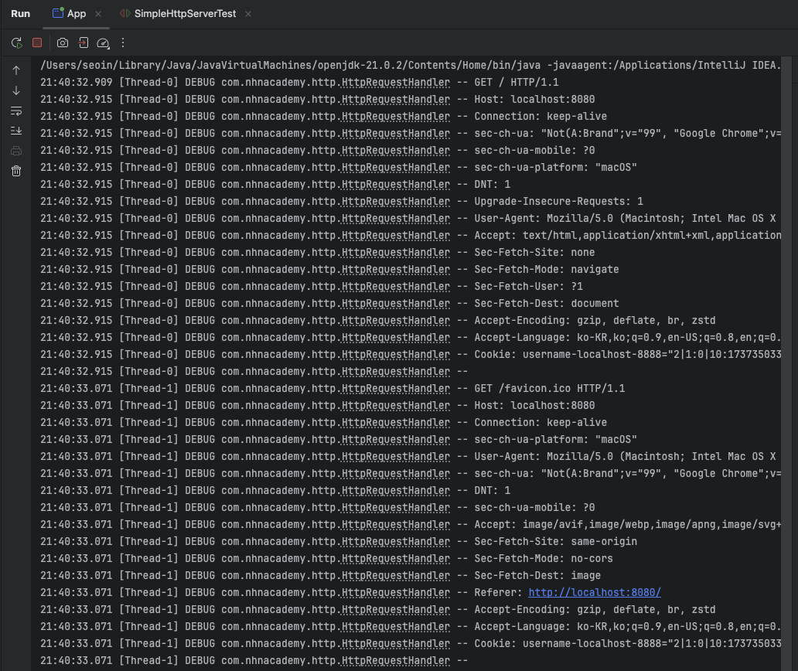

# Multi Thread Http Server
동시에 여러 요청을 처리하려면 Multi Thread를 구현한다.

## 📌` HttpRequestHandler.class`
👉🏻 클라이언트의 HTTP 요청을 처리하고, 간단한 HTML 응답을 반환하는 HTTP 서버이다.
1. 클라이언트와 연결: 클라이언트가 서버에 접속하면, Socket을 통해 연결을 수락
2. HTTP 요청 수신: 클라이언트로부터 HTTP 요청을 읽어 requestBuilder에 저장
3. HTTP 응답 생성: HTTP 응답 헤더와 응답 바디(HTML)를 생성
   - 간단한 HTML 페이지(`<h1>hello java</h1>`) 반환
4. 응답 전송: BufferedWriter를 사용하여 헤더와 바디를 클라이언트로 전송
   - flush()를 호출하여 응답을 즉시 전송
5. 소켓 종료

응답 후 클라이언트와의 연결을 닫음.

## 📌 `SimpleHttpServer.class`
👉🏻 클라이언트가 요청할 때마다 새로운 스레드를 생성하여 처리하는 멀티스레드 HTTP 서버이다.
1. 서버 소켓(ServerSocket) 생성
- 기본 포트(8080) 또는 사용자가 지정한 포트로 서버 실행
- 포트 번호가 0 이하일 경우 IllegalArgumentException 발생
- ServerSocket을 생성하여 클라이언트 연결을 기다림

2. 클라이언트 연결 대기 및 처리
- 무한 루프(while문)에서 클라이언트의 요청을 대기 (accept())
- 연결이 발생하면 HttpRequestHandler 클래스를 새로운 Thread로 실행하여 요청을 처리
- 서버가 interrupt 신호를 받으면 종료됨
  </img><br/>
  </img><br/>

---
## 🚨 step1과 step2의 차이점
| 비교 항목 | step1(싱글스레드)                      | step2(멀티스레드)         |
|---------|-----------------------------------|----------------------|
|요청 처리 방식| 싱글스레드(한 번에 하나씩 처리)                | 멀티스레드(여러 요청 동시 처리)   |
|동시성| ❌ 동시 요청 처리 불가                     | ✅ 여러 클라이언트 동시에 처리 가능 |
|구조 개선| 요청 처리 코드가 `SimpleHttpServer` 내부에 있음 | `HttpRequestHandler로` 분리하여 가독성 향상 |
|서버 종료 조건 | ❌ 강제 종료 필요 | ✅ Thread 인터럽트로 안전하게 종료 가능|
|응답 속도| 요청이 많아지면 지연 발생 | 요청이 많아도 빠른 응답 가능|
|확장성| ❌ 성능 확장이 어려움 | ✅여러 요청을 동시에 처리하여 확장성 높음 |


👉🏻**Step2는 Step1보다 더 효율적이고 확장성이 뛰어남**
Step2는 Step1보다 더 많은 요청을 효율적으로 처리할 수 있는 구조로 개선되었으며,
실제 웹 서버와 유사한 방식으로 동작할 수 있도록 업그레이드된 버전이라고 보면 된다.
- Step2는 멀티스레드를 사용하여 여러 요청을 동시에 처리할 수 있어 서버 성능이 향상
- Step1은 싱글스레드 방식이므로, 하나의 요청이 끝나야 다음 요청을 처리할 수 있음
- Step2는 HttpRequestHandler 클래스를 분리하여 유지보수가 용이
- Step2는 Thread 인터럽트를 추가하여 정상적인 서버 종료가 가능

---
## 🤔 Server Socket을 선언할 때 try-catch 구문을 항상 사용하는 이유
``` java
public SimpleHttpServer(int port) {
    if (port < 0) {
        throw new IllegalArgumentException("port must be a positive integer");
    }

    this.port = port;
    try {
		serverSocket = new ServerSocket(this.port);
	} catch (IOException e) {
	    throw new RuntimeException(e);
	}
}
``` 
ServerSocket을 생성할 때 항상 try-catch 를 사용하는 이유는 **입출력 예외(IOException)가 발생할 가능성**이 있기 때문이다.
- 포트 충돌: 해당 포트가 이미 다른 프로그램에서 사용 중이면 IOException 발생
- 권한 문제: 특정 포트(예: 1024 이하)를 사용하려면 관리자 권한이 필요할 수 있음
- 네트워크 문제: 서버가 특정 네트워크 인터페이스를 사용할 수 없는 경우 예외 발생
- 기타 시스템 오류: 소켓 리소스 부족, OS 제한 등으로 인해 예외 발생 가능

### ✔︎ CRLF = "\r\n"
``` java
private final static String CRLF="\r\n"; 
``` 
HTTP 프로토콜에서 줄바꿈을 의미 

### ✔︎ 입출력 스트림 초기화
``` java
public void run() {
    StringBuilder requestBuilder = new StringBuilder();
    try (
        BufferedReader bufferedReader = new BufferedReader(new InputStreamReader(client.getInputStream()));
        BufferedWriter bufferedWriter = new BufferedWriter(new OutputStreamWriter(client.getOutputStream()));
    ) {
``` 
- `BufferedReader` → 클라이언트 요청(HTTP Request)을 읽음.
- `BufferedWriter` → 서버 응답(HTTP Response)을 클라이언트에게 보냄.
