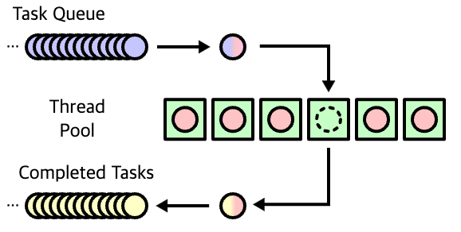
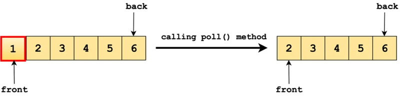

# Multi Thread Http Server
Queue를 이용하여 Client 요청을 처리하는 대기열을 구현한다.

## Thread Pool 이란?

서버는 동시 접속자가 많아지면 스레드가 무한대로 생성되면서 서버가 다운될 위험이 있다. 애플리케이션 프로세스에서 사용되고 있는 스레드의 개수를 관리하기 위해 Thread Pool을 도입한다. 

Thread Pool은 **작업 수행을 기다리는 초기화된 유휴 스레드 모음**이다. 

Queue에 스레드가 작업을 받으면 이를 실행하고, 작업이 완료되면 스레드는 다시 새 작업을 기다리게 된다.

이러한 방식으로 스레드를 재사용하면 시스템 리소스에 부담을 주지 않고 처리할 수 있다.


## 📌` HttpRequestHandler.class`

### ✔︎ poll()

Queue의 최상위 요소(헤드)를 검색하고 제거한다. 위의 대기열에서 poll()을 호출하면 결과로 '1'을 받게된다.
``` java
public synchronized Socket getRequest(){
    if (requestQueue.isEmpty()) {
        try {
            wait(); // 요청이 들어올 때까지 대기
        } catch (InterruptedException e) {
            throw new RuntimeException(e);
        }
    }
    notifyAll(); // 대기 중인 다른 스레드 깨우기
    requestQueue.roll(); // 가장 오래된 요청 반환
}
``` 
`requestQueue는` FIFO(First-In-First-Out, 선입선출) 자료구조이다. 즉, 가장 먼저 들어온 클라이언트 요청이 가장 먼저 처리된다.

`poll()`을 호출하면 가장 먼저 들어온 요청이 반환되기 때문에, 클라이언트 요청이 순서대로 처리된다.

### ✔︎ AtomicLong
Long 자료형을 갖고 있는 `Wrapping` 클래스이다.
- Thread-safe로 구현되어 멀티쓰레드에서 `synchronized` 없이 사용할 수 있다. → `synchronized` 보다 적은 비용으로 동시성 보장
기본 타입을 객체로 감싸기 (Primitive → Wrapper Class)
``` java
int primitiveValue = 10;
Integer wrappedValue = Integer.valueOf(primitiveValue); // Wrapping 과정
``` 
cf. 기본 타입의 데이터를 객체로 표현해야 하는 경우가 종종 있다. 이럴 때에 기본 자료타입(primitive type)을 객체로 다루기 위해서 사용하는 클래스들을 래퍼 클래스(wrapper class)라고 한다.

``` java
public SimpleHttpServer(){
        this(DEFAULT_PORT);
    }
    public SimpleHttpServer(int port) {
        if (port <= 0) {
            throw new IllegalArgumentException("port must be a positive integer");
        }

        this.port = port;
        atomicCounter = new AtomicLong();
    }
``` 