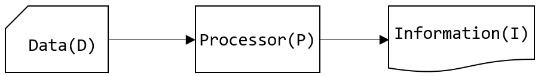

# 1️⃣ 데이터베이스 개요
### 데이터와 정보
- **데이터(data)**: 현실 세계로부터 단순한 관찰이나 측정을 통해서 수집된 사실(fact)이나 값(Value)
- **정보(Information)**:어떤 상황에 대한 적절한 의사 결정을 할 수 있게 하는 지식(Knowldege)으로서 유효한 데이터의 해석 또는 데이터 간의 관계

    

- `I = P(D)`: 정보(Information)는 데이터(Data)를 처리해서 얻어진 결과

### 정보 시스템
조직체에 필요한 데이터를 수집, 조직, 저장하고 필요시에 유효한 정보를 생성하고 분배한다.

- MIS (Management Information System – 경영 정보 시스템)
- ERP (Enterprise Resource Planning – 전사적 자원 관리)
- CRM (Customer Relationship Management – 고객 관계 관리)
- SCM (Supply Chain Management – 공급 사슬 관리)

## 데이터베이스
같은 데이터가 다른 목적을 가진 여러 응용에 중복되어 사용될 수 있다는 공용 개념의 기초이다.
- 데이터베이스의 정의
  - 통합된 데이터(Integrated Data)
  - 저장된 데이터(Stored Data)
  - 운영 데이터(Operational Data)

- 데이터베이스의 특징 👉🏻**공용 데이터(Shared Data)**
  - 실시간 접근성(Real-time Accessibility)
  - 지속적인 변화(Continuous Evolution)
  - 동시 사용(Concurrency Sharing)
  - 내용 참조(Content Reference)

## DBMS
Database Management System - 데이터베이스 관리 시스템

- 데이터의 방대한 집합체를 유지 관리하고 이용하는데 도움을 주도록 설계된 소프트웨어 
- 데이터의 종속성과 중복성의 문제를 해결하기 위해 제안된 시스템

### ✔︎ 데이터베이스 관리 시스템의 기능
데이터베이스 관리 시스템은 **CRUD**(Create(생성), Read(읽기), Update(갱신), Delete(삭제))가 기본적으로 가능해야 한다.

데이터 정의(Data Definition) 기능
- 모든 응용 프로그램이 요구하는 데이터 구조를 지원할 수 있도록 데이터베이스의 논리적 구조와 특성을 DBMS가 지원하는 데이터 모델에 맞게 기술해야 함
- 데이터 모델과 데이터베이스를 물리적 저장 장치에 저장하는데 필요한 명세 포함

데이터 조작(Data Manipulation) 기능
- 사용자와 데이터베이스 사이의 인터페이스를 위한 수단 제공 
- 사용하기 쉽고 자연스러워야 하며, 명확하고 완전해야 함 
- 공용이라는 이유로 접근이나 처리가 비효율적 이어서는 안됨

데이터 제어(Data Control) 기능
- 데이터의 갱신, 삽입, 삭제 작업이 정확히 실행되며, 무결성 제공
- 보안과 권한 검사
- 동시 사용자에 대한 병행성 제어

[다음페이지: 02. 데이터베이스 관리 시스템 개요](/Users/seoin/NHNacademy-java/relational database/docs/01.overview.md)