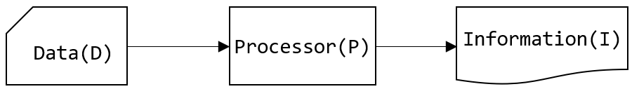

# 1️⃣ 데이터베이스 개요
## 데이터와 정보
- **데이터(data)**: 현실 세계로부터 단순한 관찰이나 측정을 통해서 수집된 사실(fact)이나 값(Value)
- **정보(Information)**:어떤 상황에 대한 적절한 의사 결정을 할 수 있게 하는 지식(Knowldege)으로서 유효한 데이터의 해석 또는 데이터 간의 관계

    

- `I = P(D)`: 정보(Information)는 데이터(Data)를 처리해서 얻어진 결과

### ✔︎ 정보 시스템
조직체에 필요한 데이터를 수집, 조직, 저장하고 필요시에 유효한 정보를 생성하고 분배한다.

- MIS (Management Information System – 경영 정보 시스템)
- ERP (Enterprise Resource Planning – 전사적 자원 관리)
- CRM (Customer Relationship Management – 고객 관계 관리)
- SCM (Supply Chain Management – 공급 사슬 관리)

## 데이터베이스
같은 데이터가 다른 목적을 가진 여러 응용에 중복되어 사용될 수 있다는 공용 개념의 기초이다.
- 데이터베이스의 정의
  - 통합된 데이터(Integrated Data)
  - 저장된 데이터(Stored Data)
  - 운영 데이터(Operational Data)

- 데이터베이스의 특징 👉🏻**공용 데이터(Shared Data)**
  - 실시간 접근성(Real-time Accessibility)
  - 지속적인 변화(Continuous Evolution)
  - 동시 사용(Concurrency Sharing)
  - 내용 참조(Content Reference)

## DBMS
Database Management System - 데이터베이스 관리 시스템

- 데이터의 방대한 집합체를 유지 관리하고 이용하는데 도움을 주도록 설계된 소프트웨어 
- 데이터의 종속성과 중복성의 문제를 해결하기 위해 제안된 시스템

### ✔︎ 데이터베이스 관리 시스템의 기능
데이터베이스 관리 시스템은 **CRUD**(Create(생성), Read(읽기), Update(갱신), Delete(삭제))가 기본적으로 가능해야 한다.

데이터 정의(Data Definition) 기능
- 모든 응용 프로그램이 요구하는 데이터 구조를 지원할 수 있도록 데이터베이스의 논리적 구조와 특성을 DBMS가 지원하는 데이터 모델에 맞게 기술해야 함
- 데이터 모델과 데이터베이스를 물리적 저장 장치에 저장하는데 필요한 명세 포함

데이터 조작(Data Manipulation) 기능
- 사용자와 데이터베이스 사이의 인터페이스를 위한 수단 제공 
- 사용하기 쉽고 자연스러워야 하며, 명확하고 완전해야 함 
- 공용이라는 이유로 접근이나 처리가 비효율적 이어서는 안됨

데이터 제어(Data Control) 기능
- 데이터의 갱신, 삽입, 삭제 작업이 정확히 실행되며, 무결성 제공
- 보안과 권한 검사
- 동시 사용자에 대한 병행성 제어

### ︎✔︎ DBMS에서 데이터의 명세 및 저장
데이터베이스 관리 시스템은 저장될 데이터를 데이터 모델(Data Model)의 형식으로 정의할 수 있도록 한다. 데이터베이스 관리 시스템은 시스템이 저장하고 관리할 데이터에 대해 지정된 데이터 모델을 사용하도록 설계된 소프트웨어이다.

- 디스크 수준에서의 데이터 저장 내역을 감추고 고 수준으로 데이터를 명세
- 데이터의 관계, 접근과 그 흐름에 필요한 처리 과정에 관한 추상화된 모형
- 현실 세계의 정보들을 컴퓨터에 표현하기 위하여 단순화, 추상화하여 체계적으로 표현한 개념적 모형
- DBMS의 데이터 저장 방식과 실제 세계의 간극을 좁히기 위해 개념 데이터 모델을 사용

### ✔︎ 데이터 모델
데이터 모델은 데이터 또는 정보를 설명하기 위한 표기법이다.
- 데이터 모델
  - 데이터의 구조(Structure of the Data)
  - 데이터에 대한 작업(Operations on the Data)
  - 데이터에 대한 제약 조건(Constraints on the Data)
- 주요 데이터 모델(오늘날의 데이터베이스 시스템)
  - **관계 데이터 모델**(Relational Data Model)👍🏻 가장 많이 쓰임
  - 반정형 데이터 모델(Semistructured-data Model)
- 기타 데이터 모델(예전에 사용되었으나 현재는 거의 사용X)
  - 네트워크 데이터 모델(Network Data Model) - **찰스 바크만🎩**
  - 계층형 데이터 모델(Hierarchical Data Model)
  - 객체 지향 데이터 모델(Object Data Model)

### ✔︎ 데이터 독립성
DBMS의 데이터는 3단계의 추상화로 표현된다.

- 각 추상화 단계 별로 응용 프로그램의 데이터 구성 및 저장 방식으로부터 격리
- 논리적 데이터 독립성(Logical Data Independency)
  - 데이터의 논리적인 구조, 저장 방식/공간의 변화로부터 보호
- 물리적 데이터 독립성(Physical Data Independency)
  - 디스크 파일 내부에서 데이터가 실제로 어떻게 배치되어 있는지 등의 정보를 감춤

### ✔︎ 데이터베이스 질의
데이터베이스로부터 정보를 얻는 방식의 쉬움 정도에 따라 데이터베이스의 가치가 좌우된다.
- 데이터를 얻기 위한 일반적인 질문(Query)의 전산학적인 구현
- DBMS는 일반적으로 **질의(Query)**를 만들 수 있는 **질의어(Query Language)**를 제공
  - 데이터 조작어(DML: Data Manipulation Language)
  - 데이터 정의어(DDL: Data Definition Language)
  - 데이터 제어어(DCL: Data Control Language)

### ✔︎ 동시 접근 및 복구
데이터베이스에는 수 많은 사용자가 동일한 데이터를 동시 접근하기 때문에, 동시 접근 및 복구를 해야 한다.

👉 특정 데이터에 대한 잠금을 줘서 문제 해결. (ex. critial setion / mutex / semaphor)
- 각 사용자의 요구사항을 상호 독립적으로 수행
- BMS는 다른 사용자가 동일한 데이터에 접근하고 있다는 것을 사용자 관점에서 무시해도 되도록 동작
- 시스템의 장애 순간에도 일관성을 유지할 수 있도록 동작
  - 장애 발생 순간에 동작에 참여중이던 데이터에 대한 일관성 유지
  - 시스템이 재시동된 후 모든 데이터를 일관성 있는 상태로 유지해야 함

### 🔥 트랜잭션
트랜잭션(Transaction)은 **데이터베이스 관리 시스템에서 사용자 프로그램의 실행 단위**이다.
동일한 동작을 여러 번 수행하는 경우 동작만큼의 트랜잭션이 발생한다.
- 🌟 **ACID** 🌟
  - **Atomicity** (원자성):
    관련 작업이 전부 처리되거나 아예 처리되지 않아야 함
  - **Consistency** (일관성):
    트랜잭션 이전과 이후에 데이터베이스의 상태는 이전과 같이 유효해야 함
  - **Isolation** (격리성):
    모든 트랜잭션은 다른 트랜잭션들로부터 독립되어 동작해야 함
  - **Durability** (지속성):
    트랜잭션이 성공적으로 수행되었다면 완료의 효과는 지속되어야 함
- 원자성과 지속성을 위해 데이터베이스 로그(Log)와 로그 우선 기록(Write Log Ahead)을 사용
- 격리성을 위해 잠금 규약(Locking Protocol)을 사용
  
- 일관성을 위해 제약 조건(Constraint)을 사용

[다음페이지: 02. 데이터베이스 관리 시스템 개요](/Users/seoin/NHNacademy-java/relational database/docs/01.overview.md)