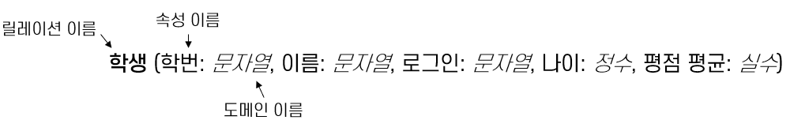
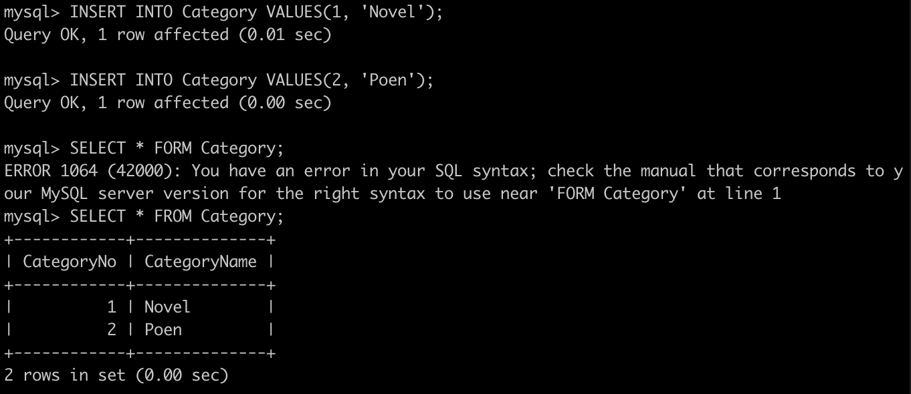
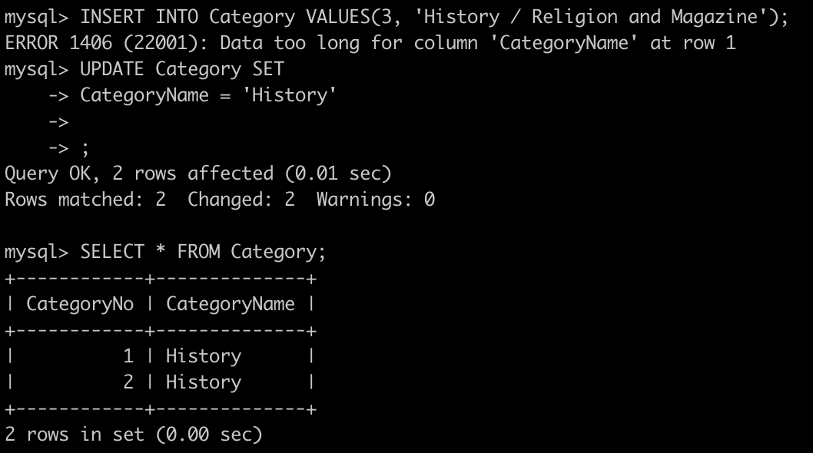
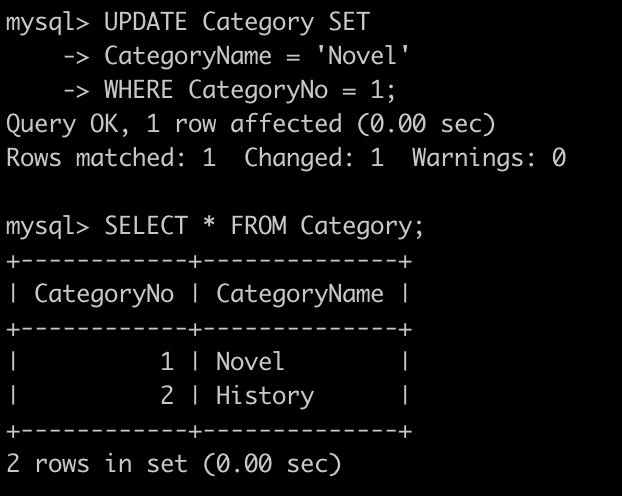
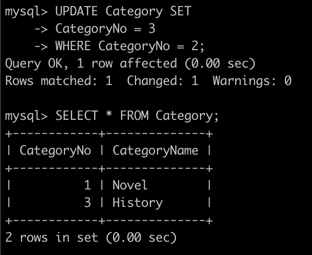

# 2️⃣ 관계 모델

관계 모델에서 데이터의 표현은 릴레이션으로 구성되며, 릴레이션은 릴레이션 스키마와 릴레이션 인스턴스로 이루어진다.
### ✔︎ 릴레이션 스키마
스키마: 어떠한 객체의 구성을 표현한 메타데이터

**릴레이션 스키마**: 개체(Entity) 와 개체의 특성을 나타내는 속성(Attribute) , 개체 간의 관계(Relation) , 이들의 제약 조건(Constraint) 을 기술한 것

- 릴레이션 스키마 명세
  - 릴레이션 이름
  - 필드(Field) 또는 열(Column) , 또는 속성(Attribute) 의 이름
  - 각 속성의 도메인(Domain) 이름

### ✔︎ 릴레이션 인스턴스
릴레이션 인스턴스(Relation Instance) 는 **레코드(Record)** 라고도 하는 **투플(Tuple) 의 집합**이며, 각 투플은 릴레이션 스키마에서 정의된 필드로 구성된다.
- **레코드(Record)** 라고도 불리는 투플(Tuple) 의 집합
- **투플(Tuple)**: 릴레이션 스키마에서 정의된 각 속성(필드) 로 정의된, 하나의 데이터 묶음
  - 릴레이션 인스턴스에서는 각 투플을 하나의 행(row) 으로 구성
- 릴레이션 인스턴스의 투플 수: `카디널리티(Cardinality)`
- 릴레이션 인스턴스의 속성(필드) 수: `차수(Degree 또는 Arity)`
  - 릴레이션 인스턴스의 투플 순서는 중요하지 않음

### ✔︎ 도메인
- 하나의 속성이 가질 수 있는 동일한 유형의 원자값들의 집합
  - 원자값: 쪼갤 수 없음
- 릴레이션 스키마는 릴레이션 인스턴스의 각 필드의 도메인을 명세(도메인 제약조건)
- 프로그래밍 언어 관점에서 필드의 데이터 타입을 의미
- `R(fi:D1, … fn:Dn) `을 릴레이션 스키마라고 하고, 각 `fi, 1 ≤ i ≤ n` 에 대한 이름이 `Di` 인 도메인에 대한 집합을 `Domi` 이라고 할 때, 도메인 제약조건을 만족하는 R의 인스턴스는 다음과 같이 n개의 필드를 가진 투플의 한 집합이 됨
  - `{ <fi: di, … fn: dn> | d1 ∈ Dom1, … dn ∈ Domn}`

### 관계 데이터베이스
**관계 데이터베이스(Relational Database)**: 서로 다른 릴레이션 이름을 가진 릴레이션들의 모임

**관계 데이터베이스 스키마(Relational Database Schema)**: 데이터베이스에 속한 릴레이션의 스키마들의 집합

---
## 💡 Lab 2-1a : SQL을 사용한 릴레이션 생성 및 수정 (MySQL)
릴레이션 스키마를 가진 두 릴레이션을 생성한다.
- Category(CategoryNo: Integer, CategoryName: String)
- Product(ProductNo: Integer, ModelNumber: String, ProductName: String, Price: float, CategoryNo: Integer)

1. Category 테이블에 데이터를 입력
   

2. Category 릴레이션의 데이터를 수정
  

3. Category 릴레이션의 데이터를 수정
  

4. Category 테이블의 CategoryNo 필드의 데이터를 수정
   

