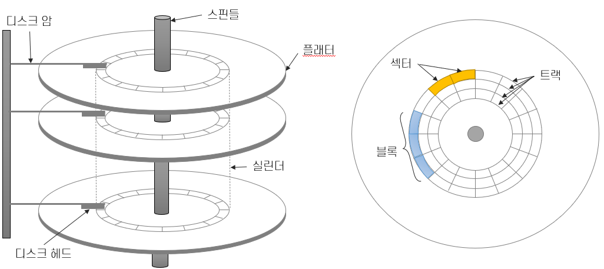
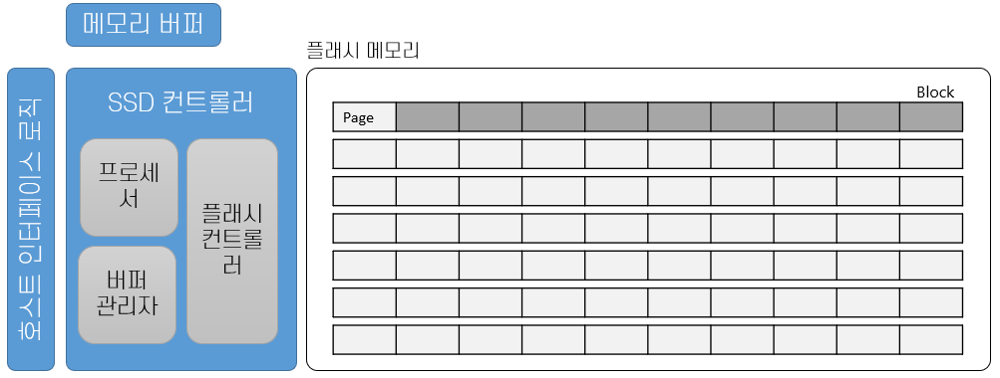
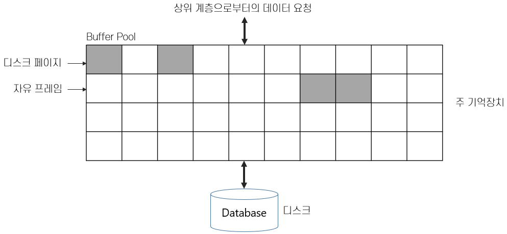
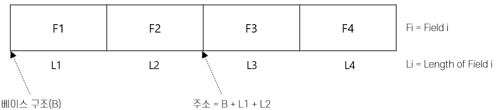
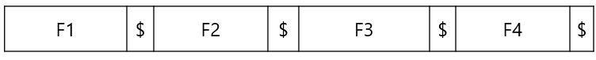
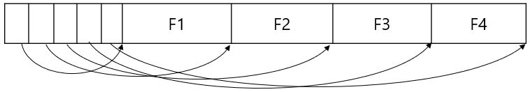

# 3️⃣ 디스크와 파일

## Chapter 1: 기억장치 계층 구조

DBMS 내부의 데이터는 디스크나 테이프와 같은 저장 장치에 저장된다. 
데이터베이스 관리 시스템은 계층화된 기억 장치로 관리되고,
각 기억장치는 각 장치를 관리하는 계층적으로 독립된 구성요소들에 의해 관리된다.

### 기억장치 계층 구조

컴퓨터 시스템의 기억장치는 계층적으로 구성된다. 
최 상위 계층에는 레지스터와 캐시, 주 기억장치로 구성되는 1차 저장장치(Primary Storage)가 있는데 매우 빠른 액세스를 제공한다. 
두 번째 계층은 2차 저장장치(Secondary Storage)로, SSD, 자기 디스크와 같은 상대적으로 느린 저장장치로 구성되며, 
마지막의 3차 저장장치(Tertiary Storage)는 가장 느린 저장장치로서 테이프 등이 해당된다.

- 데이터가 실제 저장되는 위치는 2차 저장장치에 사용
- 컴퓨터 동작시키기 위한 프로그램은 메인 메모리(1차 저장장치)에 저장
- 3차 저장장치는 백업 데이터용으로 사용

---
## Chapter 2: 디스크
### HDD(Hard Disk Drive)

- 기계 장치가 포함된 저장장치로, 자기를 이용하여 데이터를 저장하고 읽음
- 순차 접근 방식이 아닌 직접 접근 방식 → 데이터는 주 기억장치에 있어야 함
- 디스크와 주 기억장치 간의 데이터 전송 단위는 HDD의 경우 블록이므로 블록 내의 항목 중 하나만 필요한 경우라도 블록 또는 페이지의 전체 데이터가 전송되어야 함
- 블록과 페이지 입출력은 데이터 위치에 좌우됨
  `접근 시간 = 탐색시간 + 회전 지연 시간 + 전송 시간`
  - 탐구 시간(Seek time): 디스크 헤드를 원하는 블록이 있는 트랙으로 위치시키는데 걸리는 시간을 의미
  - 회전 지연 시간(Rotational delay): 원하는 블록이 디스크 헤드 아래로 오는데 걸리는 시간
  - 전송 시간(Transfer time): 헤드가 위치한 곳에서 데이터를 판독하거나 기록하는데 소요되는 시간으로, 디스크가 해당 블록위를 회전해 지나가는 시간을 의미

### SSD(Solid State Drvie)
SSD는 PD와 연결되는 호스트 인터페이스 로직(Host Interface Logic)과 데이터가 저장되는 플래시 메모리(Flash Memory), 
인터페이스와 플래시 메모리를 연결하고 제어하는 SSD 컨트롤러(SSD Controller), 외부 장치와 SSD간 사이에서 버퍼 역할을 담당하는 메모리 버퍼(Memory Buffer)로 구성된다. 

- 플래시 메모리를 기반으로 한 저장 매체로, Random Access 가능한 빠른 속도의 저장 장치
- 모든 구성요소가 전기장치이며, 기계 장치를 가지지 않음
- HDD와는 다르게 탐색 지연 시간, 회전 지연 시간이 없이 전송 시간만 소요되므로 임의적 읽기에서도 일정한 응답 속도가 보장됨
- 쓰기의 경우 비어있는 공간이 없으면 공간을 초기화하고, 이 작업 시간 동안 해당 공간에 대한 I/O 작업이 대기 상태가 됨

---
## Chapter 4: 버퍼 관리자
### 버퍼 풀

버퍼 관리자(Buffer Manager)는 필요할 때 마다 디스크로부터 페이지를 가져와서 기억장치에 적재할 책임이 있는 DBMS의 소프트웨어 계층이다.

**버퍼 관리자는 사용 가능한 주 기억장치의 공간을 페이지라는 단위들로 분할하여 관리**한다. 주 기억장치에서 이런 페이지가 모여 있는 공간을 **버퍼 풀(Buffer Pool)** 이라고 한다.

버퍼 풀내의 페이지를 **프레임(Frame)** 이라고 하는데, 프레임은 **페이지를 담을 수 있는 슬롯**이다.

### 버퍼 교체 전략
- LRU (Least Recently Used): pin_count가 0인 프레임들에 대란 포인터로 큐를 생성
- Clock: LRU의 변형으로, 1부터 N 사이의 값인 current 변수를 사용하여 교체용 페이지를 선정
- FIFO (First In First Out), MRU(Most Recently Used), Random등의 방식을 사용

---
## Chapter 5: 레코드 형식
### 고정 길이 레코드

**고정 길이 레코드(Fixed-length Record)**는 각 필드의 길이가 고정적이며 필드의 수가 고정되어 있다. 

레코드의 주소가 주어지면 시스템 카탈로그에 있는 선행 필드들의 길이 정보를 이용하여 원하는 필드의 주소(위치)를 계산해 낼 수 있어 **레코드들은 연속적으로 저장**할 수 있다.

### 가변 길이 레코드
관계형 데이터모델에서 값은 릴레이션에 속하는 모든 레코드가 같은 수의 필드만 갖게 된다. 
필드의 수가 같으므로, 필드의 길이가 가변적인 경우에만 레코드의 길이가 가변적이 된다.
- 필드를 분리자로 구분하여 연속적으로 저장하는 것
  
- 레코드의 앞 부분에 정수로 된 오프셋 값들을 배열로 저장
  

---
## Chapter 6: 페이지
### 페이지 형식
- 페이지는 레코드가 탑재되는 슬롯의 모임으로 생각할 수 있음
- 레코드는 <페이지 번호, 슬롯 번호>의 쌍으로 식별됨
- <페이지 번호, 슬롯 번호>의 쌍을 RID<Record ID>라고 하며, 레코드의 포인터 역할을 수행

