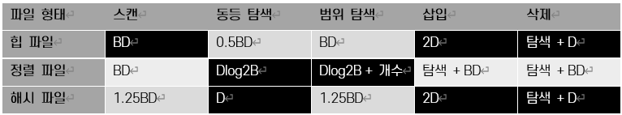
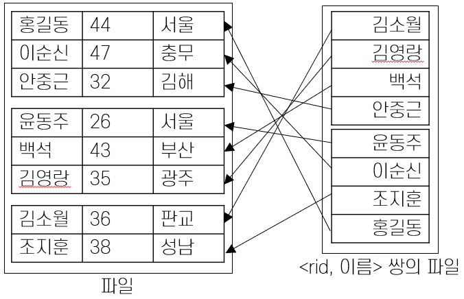
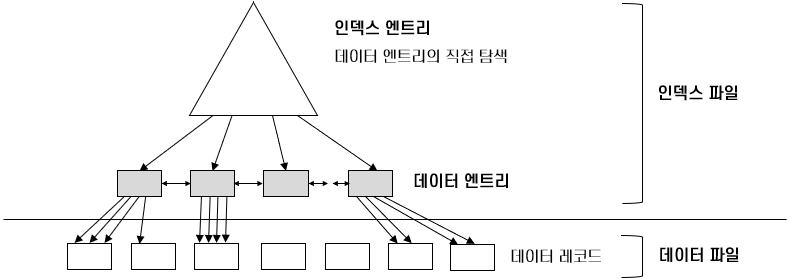
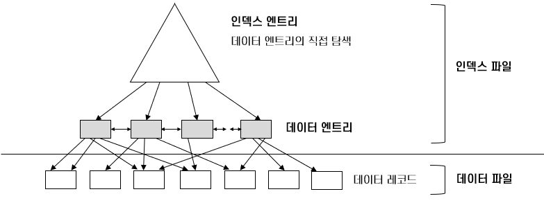
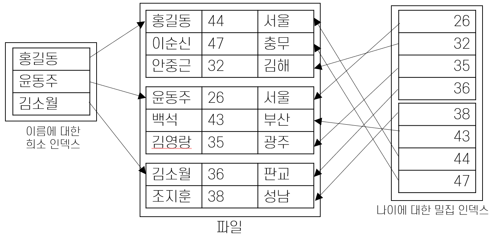

# 4️⃣ 파일 조직과 인덱스
## Chapter 1: 비용 모델과 파일 조직법
### ✔︎ 비용 모델 개요
데이터베이스 관리 시스템은 질의가 요청될 때 여러 실행 계획을 세우고 비교하여 최적화된 방법을 찾아 실행한다.

실행 계획을 세우고 비교하여 최적화된 방법을 찾아내는 DBMS 구성 요소를 **질의 최적화기(Query Optimizer)** 라고 부른다.
- 규칙 기반 옵티마이저(Rule-Based Optimizer)
  - 휴리스틱 옵티마이저라고도 불리며, 미리 정해놓은 규칙에 따라 액세스 경로를 평가하고 실행 계획을 선택 
  - 규익은 액세스 경로별 우선순위로서, 인덱스 구조, 연산자, 조건절 형태가 순위를 결정짓는 주요 요인
- 비용기반 옵티마이저(Cost-Based Optimizer)
  - 쿼리를 수행하는데 소요되는 일의 양 또는 시간을 기반으로 최적화된 실행 경로를 계산
  - 미리 구해놓은 테이블과 인덱스에 대한 통계정보를 기초로 각 실행 단계별 예상 비용을 산정하고, 이를 합산한 비용이 가장 낮은 실행 계획을 선택
  - 레코드 개수, 블록 개수, 평균 행 길이, 컬럼 값의 수, 컬럼 값 분포등을 사용하며 하드웨어적인 특성인 CPU 속도, 디스크 I/O 속도 등을 사용
  - 대부분의 RDBMS는 비용기반 쿼리 옵티마이저를 채택

여러 감안 요소 중 파일 조직별 비용을 알아보기 위해 파일 조직별 입출력 비용만 감안하여 파일 조직별 비용을 비교한다.
- B: 데이터 페이지의 개수 
- R: 페이지에 속한 레코드의 개수 
- D: 디스크 페이지를 하나를 읽는 시간 
- C: 한 레코드를 처리하는데 걸리는 시간 
- H: 한 레코드에 해시 함수를 적용하는데 걸리는 시간

### ✔︎ 파일 조직법 비교 기준 연산
- **스캔(Scan)**
파일에 있는 모든 레코드를 가져옴. 파일에 있는 페이지들은 디스크로 부터 버퍼 풀로 반입 되어야함
- **동등 셀렉션(Equality Selection)**
질의에서 요구하는 검색어와 같은 문자열임을 만족하는 모든 레코드를 가져옴
- **범위 셀렉션(Range Selection)**
1에서 10까지, 홍길동에서 이순신까지 등 범위에 해당하는 모든 레코드를 가져옴
- **삽입(Insertion)**
주어진 레코드를 파일에 삽입
- **삭제(Deletion)**
RID로 명세된 레코드 삭제

### ✔︎ Heap 파일
- 정렬되지 않은 단순한 형태의 파일
- 스캔 B(D+RC)
- 동등 셀렉션 후보 키에 대한 연산일 경우 0.5B(D+RC). 후보 키가 아닌 경우 스캔과 동일 
- 범위 셀렉션 스캔과 동일 
- 삽입 레코드가 항상 파일의 끝에 삽입된다고 가정할 경우 2D+C 
- 삭제 탐색 비용 + C + D

### ✔︎ 정렬 파일
- 특정 필드를 기준으로 정렬된 파일
- 스캔: 힙 파일과 다르지 않음. B(D+RC)
- 동등 셀렉션: 정럴 기준 필드로 검색할 경우 이진 탐색으로 Dlog2B + Clog2R. 정렬 필드가 아닌 경우 스캔과 동일
- 범위 셀렉션: 정렬 기준 필드로 검색할 경우 첫 레코드를 찾는데 동등 셀렉션과 동일. 이후 범위내 스캔
- 삽입: 정렬 순서를 유지하기 위해 레코드가 삽입될 위치를 검색 후 레코드 추가. 후속 페이지를 모두 로드하여 다시 저장. 탐색 비용 + B(D + RC)

### ✔︎ 해시 파일
- 특정 필드를 기준으로 정렬된 파일
- 스캔: 힙 파일과 다르지 않음. B(D+RC)
- 동등 셀렉션: 정럴 기준 필드로 검색할 경우 이진 탐색으로 Dlog2B + Clog2R. 정렬 필드가 아닌 경우 스캔과 동일
- 범위 셀렉션: 정렬 기준 필드로 검색할 경우 첫 레코드를 찾는데 동등 셀렉션과 동일. 이후 범위내 스캔
- 삽입: 정렬 순서를 유지하기 위해 레코드가 삽입될 위치를 검색 후 레코드 추가. 후속 페이지를 모두 로드하여 다시 저장. 탐색 비용 + B(D + RC)

### ✔︎ 파일 조직 선택

힙 파일은 저장 성능이 우수하고 스캔, 삽입, 삭제 연산이 빠르지만 탐색은 느리다.

정렬 파일은 저장 성능이 우수하고, 삽입과 삭제 연산이 느리지만 탐색은 대단히 빠르다. 👉🏻 실제로는 가장 많이 이용됨

해시 파일은 저장 성능이 떨어지지만, 삽입과 삭제가 빠르며 동등 탐색에서 대단히 우수하다. 하지만 범위 탐색은 지원하지 못하며 스캔 성능이 떨어진다.

---
## Chapter 2: 인덱스
### ✔︎ 인덱스 개요

- 해당 파일의 기본적인 레코드 조직법으로는 효율적으로 지원되지 않는 연산의 속도를 높이기 위해 만드는 보조적인 자료구조
- 데이터 엔트리(Data Entry)들의 모임

### ✔︎ 클러스터드 인덱스

- 파일을 조직할 때 레코드의 순서를 파일에 대한 인덱스의 순서와 동일한 순서로 유지
- 파일의 재조직이 필요한 구조
- 데이터가 삽입/삭제될 때 마다 정렬 순서를 유지하기 위해서 그 주변의 데이터를 이동해야 함
- 파일이 동적으로 변하는 경우 유지 관리 오버헤드가 높음

### ✔︎ 넌 클러스터드 인덱스

- 하나의 데이터 파일은 하나의 탐색키에 대해서만 클러스터링 될 수 있음
- 하나의 데이터 파일에 대해 하나의 클러스드 인덱스만 만들 수 있음
- 클러스터드 인덱스 구조 파일의 키가 아닌 필드의 빠른 검색을 위한 보조 자료구조

### ✔︎ 밀집 인덱스와 보조 인덱스

- 밀집 인덱스(Dense Index): 파일에 있는 모든 탐색 키 값에 대해 데이터 엔트리를 구성
- 희소 인덱스(Sparse Index): 데이터 파일의 페이지별로 하나의 데이터 엔트리를 구성

### ✔︎ 기본 인덱스와 보조 인덱스
- 기본 키를 포함한 필드들에 대한 보조 인덱스를 기본 인덱스라고 부름
    - 기본 키가 존재하는 테이블은 기본 키가 클러스터드 인덱스가 되고 해당 자료구조로 테이블을 조직하는 DBMS도 있음
    - 기본 키를 희소, 클러스터드 인덱스로 지정하는 DBMS도 있음
- 기본 키 이외의 인덱스들을 보조 인덱스로 부름
  - 동일한 탐색 키 필드에 대해 데이터 엔트리가 두 개 존재하는 경우 중복되었다고 함
  - 키 필드가 아닌 필드에 대한 인덱스에는 중복이 나타날 수 있음
- 해당 탐색 키에 후보 키가 포함되는 경우, 그 키에 대한 인덱스를 유일 인덱스라고 부름