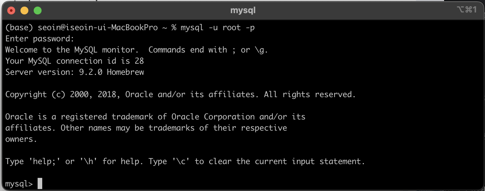
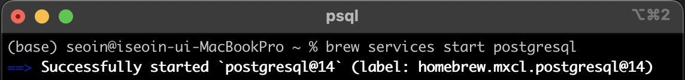
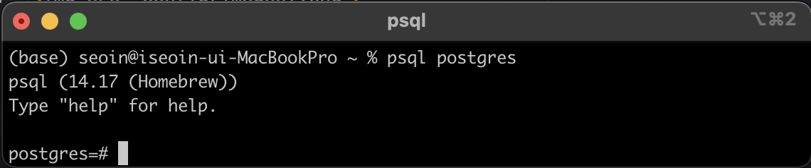

# 🐳 docker
가상화 = 프로세스 가상화 + 서버 가상화

서버 가상화를 하면 운영체제가 다 올라가야 함

## [MySQL](https://github.com/gikpreet/class-environment_settings/blob/main/04_Database/01_mysql/02_mysql_on_macos.adoc)

`mysql -u root -p` 명령어를 실행하여 mysql 서버에 접속

## [PostgreSQL](https://github.com/gikpreet/class-environment_settings/blob/main/04_Database/03_postgresql/02_postgres_on_macos.adoc)

brew services start postgresql 명령어를 실행하여 PostgreSQL Server를 시작한다.

`psql postgres` 명령어를 실행하여 데이터베이스에 접근한다.