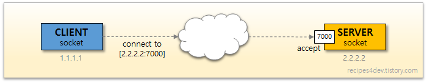
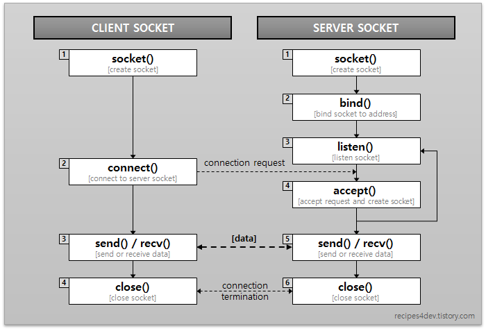

# Socket
</img> 
- `client socket`: 연결 요청을 보냄
- `server socket`: 연결 요청을 받음

두 개는 동일한 소켓이며, 소켓의 역할과 구현 절차 구분을 위해 다르게 부르는 것일 뿐이다.

</img> 
#### 👏🏻클라이언트 소켓 (Client Socket)
1. 처음 소켓(Socket)을 생성(create)
2. 서버 측에 연결(connect)을 요청
3. 서버 소켓에서 연결이 받아들여지면 데이터를 송수신(send/recv)
4. 모든 처리가 완료되면 소켓(Socket)을 닫음(close)

#### 🎁 서버 소켓 (Server Socket)
1. 소켓(Socket)을 생성(create)
2. 서버가 사용할 IP 주소와 포트 번호를 생성한 소켓에 결합(bind)
3. 클라이언트로부터 연결 요청이 수신되는지 주시(listen)
4. 요청이 수신되면 요청을 받아들여(accept) 데이터 통신을 위한 소켓을 생성
5. 새로운 소켓을 통해 연결이 수립(ESTABLISHED)
6. 클라이언트와 마찬가지로 데이터를 송수신(send/recv)
7. 데이터 송수신이 완료되면, 소켓(Socket)을 닫음(close)