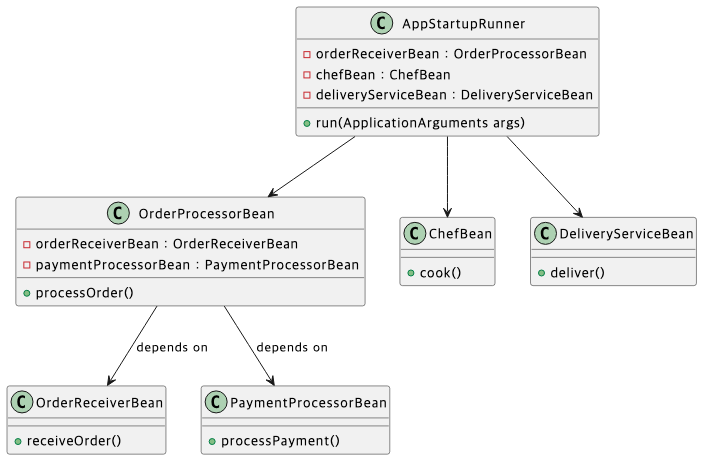

# 🍃 Spring Boot 프로젝트 제작

## 조건
1. Spring Boot 최신 릴리즈 버전을 사용한다 
2. 자바 17 이상 버전을 사용한다. 
3. maven 빌드를 이용한다. 
4. 2가지 방식의 Bean 생성 방식을 모두 이용해야 한다. 
5. 3가지 방식의 Bean 의존성 주입(사용) 방식을 모두 이용해야 한다. 
6. AppStartupRunner 에 의존성을 주입해서 단계에 따라 적절한 텍스트를 출력한다. 
7. 최소 아래 5개의 Bean 을 생성 해야한다. (추가로 더 생성해도 된다)
   - 주문 처리 Bean (OrderProcessorBean)
       - 주문 처리 Bean 은 주문 받는 Bean 과 결제하는 Bean 을 의존성 주입 받아서 단계대로 실행한다.
   - 주문 받는 Bean (OrderReceiverBean)
     - 주문을 받는다는 출력을 한다.
   - 결제하는 Bean (PaymentProcessorBean)
     - 결제 처리를 한다 는 출력을 한다.
   - 요리하는 Bean (ChefBean)
     - 요리 한다 는 출력을 한다.
   - 배달하는 Bean (DeliveryServiceBean)
     - 배달 한다 는 출력을 한다.
     


---
## 두 가지 Bean 생성 방식
1.	@Configuration + @Bean 방식
- ChefBean과 DeliveryServiceBean
- 이 두 Bean은 ChefDeliveryConfig 클래스 내에서 @Bean 메서드로 등록
- 즉, 직접 자바 메서드를 통해 Bean 인스턴스를 생성하는 방식.
2.	@Component 스캔 방식
 - PaymentProcessorBean, OrderReceiverBean, OrderProcessorBean
 - @Component 어노테이션이 붙어 있어 컴포넌트 스캔을 통해 자동으로 Bean으로 등록
 - AppStartupRunner도 @Component를 사용하여 등록

## 2. 세 가지 Bean 의존성 주입 방식
1. 필드 주입 (Field Injection)
   - OrderProcessorBean 내부에서 PaymentProcessorBean에 대해 @Autowired를 이용해 필드 주입을 사용
   ```java
       @Autowired
       private PaymentProcessorBean paymentProcessorBean;
   ```      
2. Setter 주입 (Setter Injection)
   - OrderProcessorBean에서 OrderReceiverBean은 setter 메서드를 통해 주입
   ```java
       @Autowired
       public void setOrderReceiverBean(OrderReceiverBean orderReceiverBean) {
           this.orderReceiverBean = orderReceiverBean;
       }
   ```

3. 생성자 주입 (Constructor Injection)
   - StartupRunner에서는 생성자 주입을 사용하여 OrderProcessorBean, ChefBean, DeliveryServiceBean을 주입
   - bok의 @RequiredArgsConstructor를 활용해 생성자 주입
   ```java
       @RequiredArgsConstructor
       @Component
       public class AppStartupRunner implements ApplicationRunner {
           private final OrderProcessorBean orderProcessorBean;
           private final ChefBean chefBean;
           private final DeliveryServiceBean deliveryServiceBean;
           ...
       }
```